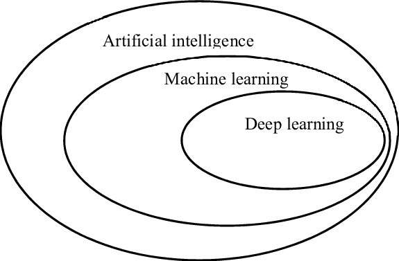

# 
BJ NedHacks Fall 2022

&nbsp;
## 
Artificial Intelligence Sessions provided by:

## Introductions
* [LinkedIn Profile](https://www.linkedin.com/in/j-langley-91166016/)
* [Huntsville AI](https://hsv.ai)

## Discussion on "What is AI"

The traditional practice of computer programming is that you write a program that tells a computer exactly what to do. The difference with AI is that you write a program that tells a computer how to learn from data or its environment and take action based on what it has learned.

Also - you may here different terms like Artificial Intelligence, Machine Learning, Deep Learning, etc. Here's a good diagram that shows the relationship of these fields:

---

---

There are also two different techniques that are used with AI that you may come across:
* Supervised Learning
* Unsupervised Learning

Now that we have that basic explanation behind us, let's jump into a more detailed look at neural networks. They are the key technique that enable AI.

* [First Neural Network](https://towardsdatascience.com/first-neural-network-for-beginners-explained-with-code-4cfd37e06eaf)
* [Neural Net Activation Functions](https://www.freecodecamp.org/news/deep-learning-neural-networks-explained-in-plain-english/)
* [Neural Network Demo](https://playground.tensorflow.org/)

Moving past the smaller machine learning problems, we can take a look at a deep learning approach for image classification. This uses a ResNet34 architecture along with transfer learning to be able to classify images of cats and dogs based on their breed:

Hands-On-Demo - [FastAI Lesson 2](https://colab.research.google.com/github/fastai/course-v3/blob/master/nbs/dl1/lesson1-pets.ipynb)

* Don't forget to pip install fastai==1.0.61
* Classification Tasks
* Data Augmentation
* Training / Validation Sets
* Learning Rate
* Confusion Matrix

## **Questions?**
---

## Additional Resources

* [ML for Beginners by Microsoft](https://github.com/microsoft/ML-For-Beginners)
* [Pytorch Tutorials](https://pytorch.org/tutorials/)
* [Tensorflow Tutorials](https://www.tensorflow.org/tutorials)
* [Deep Learning book by Ian Goodfellow](https://www.deeplearningbook.org/)
* [Scikit Learn documentation](https://scikit-learn.org/stable/)

## Get Connected:

* Email jlangley@hsv.ai
* Twitter @jperiodlangley
* [Huntsville AI on LinkedIn](https://www.linkedin.com/groups/12177562/)
* [Huntsville AI on Facebook](https://www.facebook.com/groups/390465874745286/)
---
## More Backup Material
Hands-On-Demo - [Text Analysis](https://github.com/HSV-AI/presentations/raw/master/2018/180516_Text_Analysis_Approaches.pdf)
- SpaCy - [Demo](https://github.com/HSV-AI/presentations/blob/master/2019/190417_spaCy.ipynb)
- Word Vectors [Demo](https://github.com/HSV-AI/presentations/blob/master/2019/190508_Word_Document_Vectors.ipynb)

Hands-On-Demo - 
Exploratory Data Analysis & Recommendation Systems: [Recommendation Notebook](https://github.com/HSV-AI/product-recommendation/blob/dev/notebooks/ECommerce-Implicit-Recommendation.ipynb)

Additional: - 
* [Generating Music](https://colab.research.google.com/notebooks/magenta/piano_transformer/piano_transformer.ipynb#scrollTo=-O4niaxYPWyR)
* [Applying Generated Tones](https://colab.research.google.com/notebooks/magenta/gansynth/gansynth_demo.ipynb#scrollTo=EwFvRyg6xSoz)

