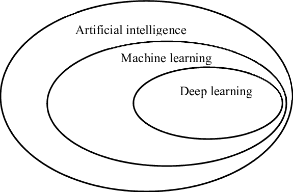

# 
Overview of Artificial Intelligence

## Purpose

The purpose of this talk is to give you a general overview of Artificial Intelligence, what it can and can't do, and how you can get involved.

We'll cover the types of technology that you need to learn to be productive in AI as well as the type of work available.

# Introductions

* [LinkedIn Profile](https://www.linkedin.com/in/j-langley-91166016/)
* [Huntsville AI](https://hsv.ai)
* [MASC-F](https://news.lockheedmartin.com/2019-08-07-Missile-Defense-Agency-Awards-Lockheed-Martin-240M-Contract-to-Support-Ballistic-Missile-Defense-Modeling-and-Simulation)

Discussion on "What is AI"

The traditional practice of computer programming is that you write a program that tells a computer exactly what to do. The difference with AI is that you write a program that tells a computer how to learn from data or its environment and take action based on what it has learned.

Also - you may here different terms like Artificial Intelligence, Machine Learning, Deep Learning, etc. Here's a good diagram that shows the relationship of these fields:

There are also two different techniques that are used with AI that you may come across:
* Supervised Learning
* Unsupervised Learning

Hands-On-Demo - [FastAI Lesson 2](https://colab.research.google.com/github/fastai/course-v3/blob/master/nbs/dl1/lesson1-pets.ipynb)

[Newer Demo that works](https://colab.research.google.com/github/walkwithfastai/walkwithfastai.github.io/blob/master/nbs/course2020/vision/01_Pets.ipynb#scrollTo=dxIGGQRL1RCn)

[Results of newer demo](https://walkwithfastai.com/Pets)
* Classification Tasks
* Data Augmentation
* Training / Validation Sets
* Learning Rate
* Confusion Matrix

# Discussion of Training vs FineTuning

**Break**

* [History of Deep Learning](https://github.com/HSV-AI/presentations/raw/master/2018/180207_Deep_Learning_History.pdf)
* [Catapult Simulator](http://www.virtualtrebuchet.com/)
* [First Neural Network](https://towardsdatascience.com/first-neural-network-for-beginners-explained-with-code-4cfd37e06eaf)
* [Neural Net Activation Functions](https://www.freecodecamp.org/news/deep-learning-neural-networks-explained-in-plain-english/)

Hands-On-Demo - [Neural Networks](https://playground.tensorflow.org/)

# Text Analysis

Recap of Day 1

Hands-On-Demo - [Text Analysis](https://github.com/HSV-AI/presentations/raw/master/2018/180516_Text_Analysis_Approaches.pdf)
- SpaCy - [Demo](https://github.com/HSV-AI/presentations/blob/master/2019/190417_spaCy.ipynb)
- Word Vectors [Demo](https://github.com/HSV-AI/presentations/blob/master/2019/190508_Word_Document_Vectors.ipynb)

**Questions?**

## Additional Resources

* [ML for Beginners by Microsoft](https://github.com/microsoft/ML-For-Beginners)
* [Pytorch Tutorials](https://pytorch.org/tutorials/)
* [Tensorflow Tutorials](https://www.tensorflow.org/tutorials)
* [Deep Learning book by Ian Goodfellow](https://www.deeplearningbook.org/)
* [Scikit Learn documentation](https://scikit-learn.org/stable/)

## Get Connected:

* Email jlangley@hsv.ai
* Twitter @jperiodlangley
* [Huntsville AI on LinkedIn](https://www.linkedin.com/groups/12177562/)
* [Huntsville AI on Facebook](https://www.facebook.com/groups/390465874745286/)
