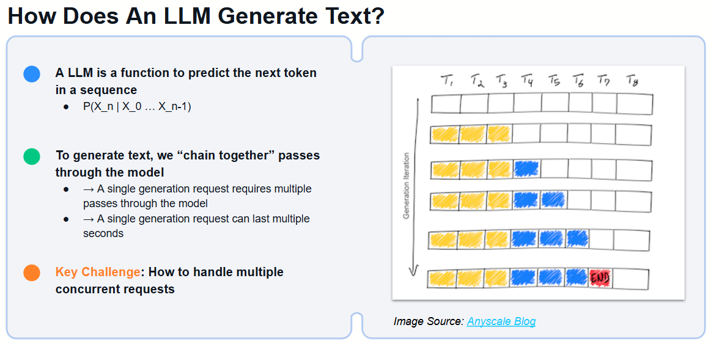
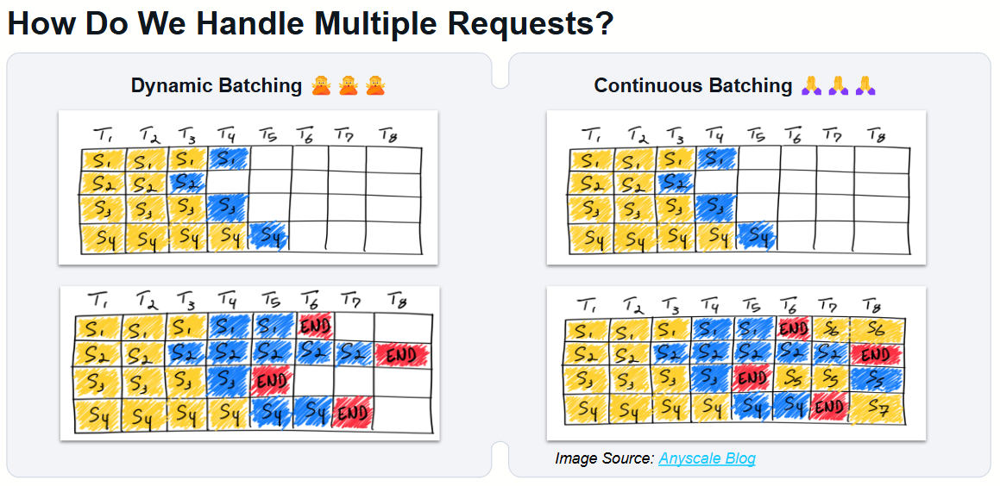
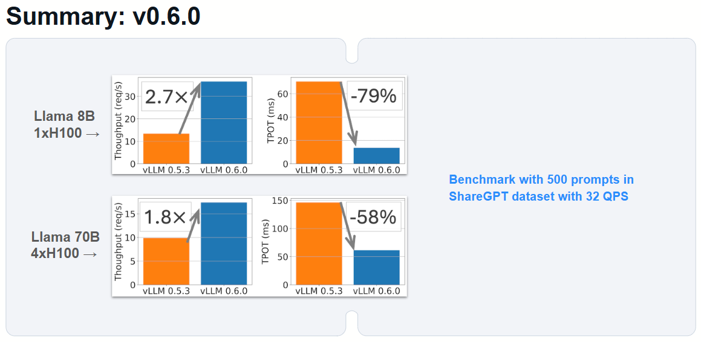

# VLLM Primer

In this session, we will demonstrate how easy it is to deploy vLLM on RunPod using an A40 GPU instance (approximately $0.40 per hour for 48GB of VRAM). We will be deploying the new LLama 3.2 11B vision model to showcase vLLM's deployment simplicity and performance capabilities in a cost-effective environment. This hands-on example will provide practical insights into getting started with vLLM and show the real-world benefits of using a platform like RunPod for efficient model serving.

## Key Features of vLLM

- Optimized for efficient serving of large language models

- Supports dynamic batching for higher throughput

- Maintains low latency with advanced memory management

- Easily integrates with popular frameworks and APIs

### Architecture

- Implements a novel memory management approach called PagedAttention for high efficiency

- Supports various LLM architectures, usually up to date with huggingface Transformers

- Designed for scalability and flexible deployment options

### Quantization Techniques

vLLM supports quantization techniques such as AWQ and GPTQ (Int8/Int4) which help in reducing the memory footprint of large models without significant performance degradation. These techniques are particularly useful when deploying models on hardware with limited resources, such as lower-tier GPUs, allowing for cost-effective inference with optimized throughput.

### Low Rank Adapters Scoped by Request

Loras can be applied easily at runtime allowing for some extremely interesting flows to quickly swap between loras between requests.

### Hands-On Deployment Considerations

vLLM can be deployed across various environments, including local servers, cloud servers (e.g., AWS, GCP), and even Google Colab for experimentation. For this demonstration, we will focus on deploying vLLM on RunPod with an A40 GPU, showcasing how to leverage dynamic batching, efficient memory management, and RunPod's cost-effective GPU resources. This setup will provide an optimal balance between performance and cost, making it an attractive option for production and experimental deployments.

## vllm magic sauce

