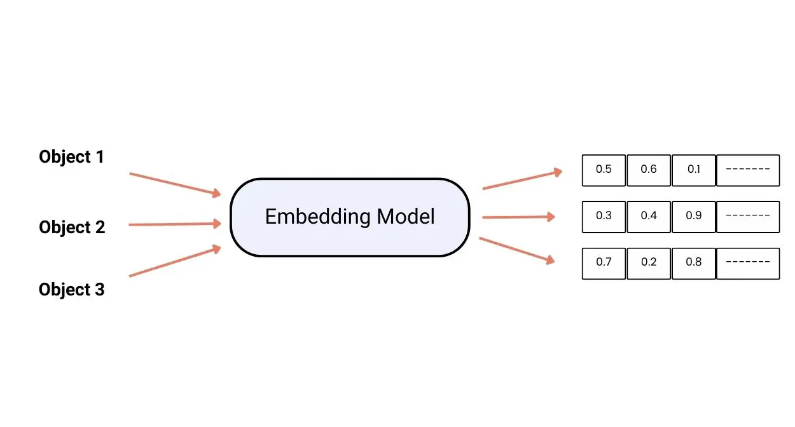
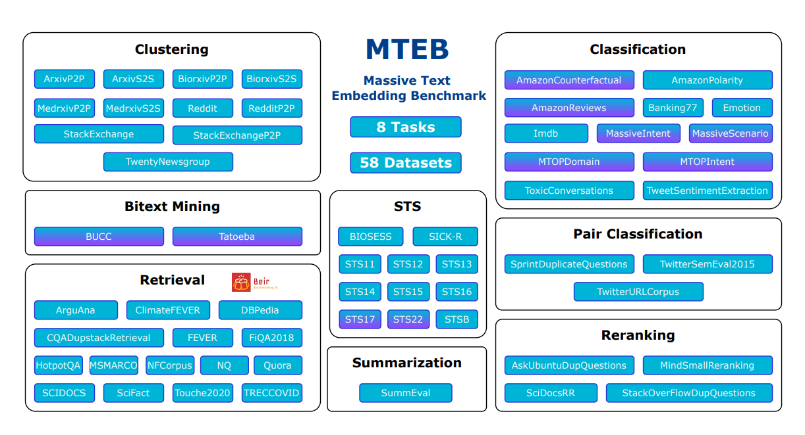
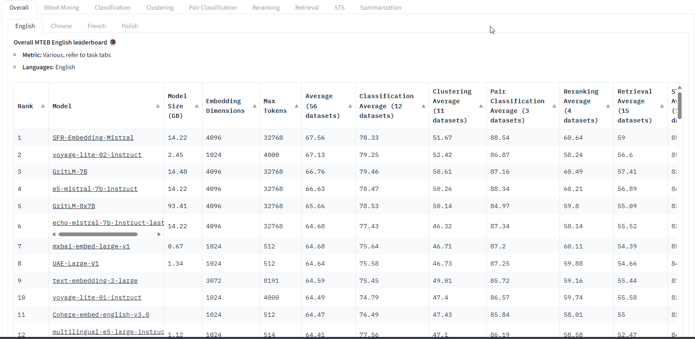
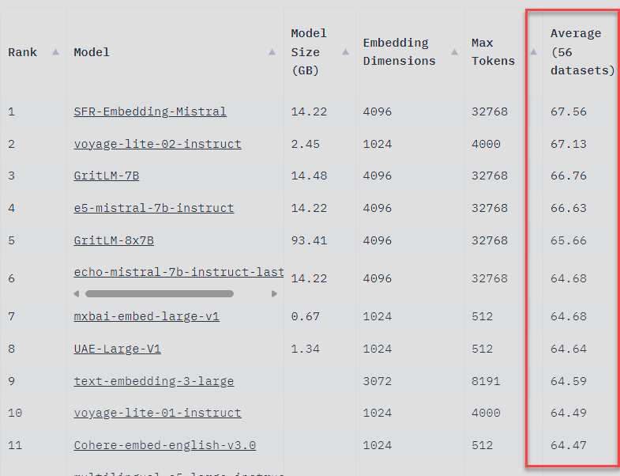
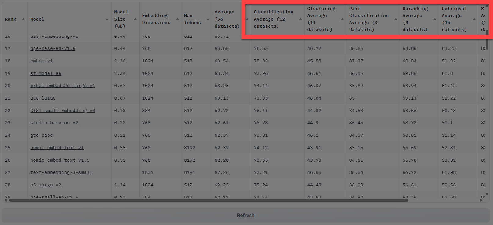
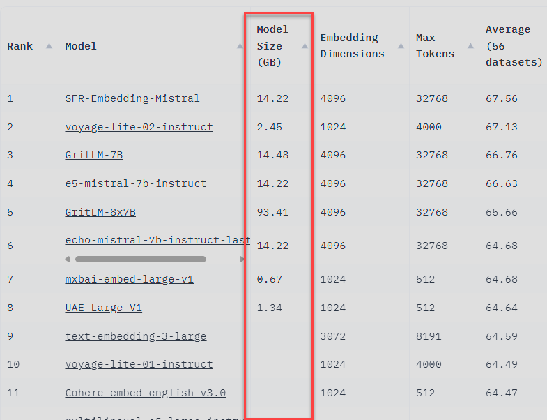
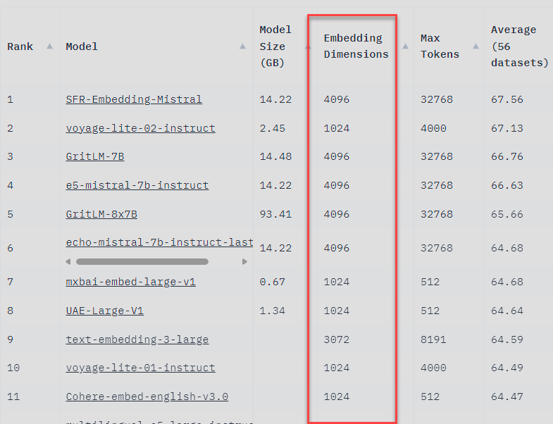

# Welcome

- Vision
- Mission
- How to Connect - [Signup](https://hsv.ai/subscribe)

# How to Pick an Embedding Model

## *TL;DR*
-  *Selecting the optimal embedding model is crucial for maximizing downstream AI performance but can be challenging due to the vast landscape of options and trade-offs.*
-  *The Multilingual Transferable Embedding Benchmark (MTEB) provides a comprehensive framework for evaluating embedding models across 8 diverse task categories and 100+ languages.*
-  *By leveraging MTEB, you can identify the most relevant tasks for your use case, shortlist candidate models based on leaderboard performance and pragmatic **factors, and** run tailored benchmarks on your specific data.*
-  *Key considerations for final model selection include accuracy vs. compute trade-offs, flexibility for fine-tuning, licensing costs, and deployment requirements.*
## Introduction

In the domain of artificial intelligence, selecting the optimal embedding model is a critical decision that significantly impacts the performance of downstream tasks. This decision is complicated by the variety of available models, each with its own trade-offs regarding accuracy, computational efficiency, and linguistic versatility.

This dilemma has given rise to a vibrant area of research aimed at developing systematic benchmarks and processes for embedding model evaluation. At the forefront is the Multilingual Transferable Embedding Benchmark (MTEB), an open-source (Apache 2.0) effort to comprehensively assess the generalization and transfer capabilities of text embedding models across 8 core tasks, 58 datasets, and 112 languages.

## Prerequisites

While hands-on experience with deep learning frameworks and pre-trained NLP models can be beneficial, it is not strictly necessary to follow along with the conceptual explanations and practical insights shared in this post.

To get the most out of this post, it will be helpful to have:

-  A basic understanding of natural language processing (NLP) concepts, such as text embeddings, language models, and common NLP tasks (e.g., classification, retrieval, summarization).
-  Familiarity with the general principles of machine learning evaluation, such as train-test splits, cross-validation, and performance metrics.
-  Awareness of the different types of embedding models (e.g., static vs. contextualized) and their typical use cases.
-  Access to a system with at least 8 GB of VRAM in order to be able to run basic embeddings alongside with 7B parameter language models. 

We will focus on the high-level strategies and considerations for embedding model selection, making this content accessible to a wider audience of machine learning practitioners, data scientists, and technical decision-makers.

With that said, let's dive into the world of MTEB and explore how it can guide us towards optimal embedding models for our specific needs.

## Unpacking the 8 MTEB Tasks

At the core of MTEB is its holistic coverage of 8 fundamental natural language processing tasks that collectively assess an embedding model's generalization capabilities. Let's take a closer look at what each of these tasks entails and their significance for different applications:
| Task | Description | Key Applications |
|------|-------------|------------------|
| **Bitext Mining** | Identifying translated pairs of text across languages from large unstructured datasets. This tests an embedding's ability to capture cross-language semantic alignment. | Machine translation, multilingual content alignment, cross-lingual information retrieval |
| **Classification** | Assigning categories or labels to text inputs across various datasets spanning different domains like news, reviews, questions etc. This probes general text understanding capabilities. | Content categorization, sentiment analysis, spam detection, intent classification |
| **Clustering** | Grouping similar text passages together without any categorical labels. This evaluates how well an embedding captures semantic closeness and linguistic nuances. | Topic modeling, document organization, anomaly detection, data exploration |
| **Pair Scoring** | Scoring the semantic relatedness between pairs of texts. Useful for tasks like query/passage ranking, dialogue coherence etc. | Information retrieval, question answering, conversational AI, text similarity |
| **Reranking** | Reordering an initial list of texts based on their relevance to a given query or context. Tests understanding of subtle context dependencies. | Search result refinement, personalized recommendations, context-aware ranking |
| **Retrieval** | Retrieving the most relevant texts from a corpus based on a query text. A core capability for applications like search engines and question answering. | Document retrieval, open-domain question answering, citation recommendation |
| **Semantic Textual Similarity (STS)** | Scoring the semantic equivalence between pairs of texts on a graded scale. Widely used to assess fine-grained semantic encoding capabilities. | Paraphrase detection, duplicate content identification, semantic search |
| **Summarization** | Generating concise summaries while preserving the key semantics of longer input texts. Evaluates the embeddings' distilled semantic understanding. | Abstractive summarization, content curation, knowledge distillation |

### But which do I focus on?

By highlighting the key applications for each task, you can quickly identify which test scores on the MTEB leaderboard are most relevant to your specific use case. For example:

-  If you're building a multilingual search engine, pay close attention to the Bitext Mining and Retrieval columns.
-  For a content recommendation system, Classification, Pair Scoring, and Reranking performance would be top priorities.
-  A text summarization application would primarily focus on the Summarization and Semantic Textual Similarity columns.

Of course, many real-world applications span multiple task types, so it's important to consider the overall balance of performance across the board. The beauty of MTEB is that it allows you to assess this generalization potential holistically.

## Shortlisting Candidate Models

Follow along in this next section by visiting the leaderboard at [HuggingFace](https://huggingface.co/blog/mteb)

With our priority tasks identified, we can start narrowing things down to a shortlist of candidate embedding models to evaluate further. The MTEB leaderboards provide a great starting point, allowing us to quickly filter models based on criteria like:

**Overall Task Performance**: 

Some models like SFR-Embedding-Mistral, voyage-lite-02-instruct, or GriLM-7B demonstrate strong generalization across many tasks, this is a good broad indicator for model quality, but might not guarantee that the model is right for your use case. 

**Specific Task Rankings: **

For focused use cases, prioritize top performers for that task category.

**Model Size:** 

Larger models tend to be more accurate but require substantial GPU memory. MTEB includes models ranging from 0.67GB (mxbai-embed-large-v1) to 93.41GB (GritLM-8x7B).

**Embedding Dimensions: **

The Embedding Dimension column shows the dimensionality of the output embeddings. Higher dimensions can encode more information but also require more memory. Most top models have very high embedding dimensions like 4096 for Mistral/GritLM models. But models like mxbai-embed-large-v1 and Cohere achieve high performance with 1024 dimensions. We should pick dimensionality based on the complexity of the semantic understanding required

Leaderboard rankings only tell part of the story. We must also consider factors like:

-  **Static Embeddings vs. Fine-Tuned:** MTEB separates pre-trained embeddings from models additionally fine-tuned on each task. Fine-tuning can boost performance but increases complexity.
-  **Licensing and Cost:** Some models are open-source, while others require paid APIs or commercial licenses.
-  **Deployment Requirements****:** Low-latency inference, model quantization, and other deployment-specific needs.

By cross-referencing leaderboard performance with these pragmatic considerations, we can distill down to a handful of models (e.g. 3-5) that warrant deeper investigation through tailored benchmarking.

## Tailored Benchmarking

While the MTEB benchmark provides a comprehensive testbed, accurately assessing embedding models for your specific use case requires running custom evaluations on relevant data distributions. Even top-performing models can experience significant shifts in accuracy when faced with out-of-domain inputs.

The tailored benchmarking process should incorporate:

-  Representative data from your target domain and application. This could be proprietary datasets, query logs, or other "real-world" data sources.
-  Subsets of MTEB's public test data for your highest-priority tasks. This allows equitable comparison against the benchmark.
-  Both zero-shot and few-shot prompting scenarios mimicking planned production settings.

For example, when evaluating embedding models for a biomedical question-answering system, we'd want to create test sets combining data from medical literature with public MTEB QA datasets. We could then run zero-shot evaluations using the original benchmark prompts as well as few-shot prompting tailored to the domain.

By running comprehensive tailored benchmarks across in-domain, out-of-domain, zero-shot, and few-shot conditions, we can gauge each embedding model's true capabilities specific to our needs

Tips for effective benchmarking:

-  Start small and scale gradually
-  Collaborate with domain experts for task design and analysis
-  Automate evaluation workflows for reproducibility

If you are looking for ways to automate llm evaluation check a post I made on the DSPy project here [CFI Blog : DSPy - Revolutionizing Complex System Development](https://blog.cohesionforce.com/2024/02/19/dspy-revolutionizing-complex-system-development-with-language-models/): 

## Model Selection Criteria

With tailored benchmarking results in hand, we can now synthesize all the relevant factors into a final embedding model selection decision. Key considerations include:

**Accuracy vs. Compute Trade-offs**

The tailored benchmarks will reveal the performance versus compute cost profile for each model under real-world conditions. We must strike the right balance between models that maximize accuracy on our priority tasks and those that fit within our available GPU memory, latency, and scaling constraints.

**Embedding vs. Fine-Tuning Flexibility**

Static pre-trained embeddings offer a plug-and-play solution, while fine-tuned models unlock another level of accuracy but require more engineering overhead. The optimal choice depends on your performance needs, available compute budget, and product roadmap.

**Licensing Costs and Commercial Support**

For enterprises, embedding models requiring paid APIs or commercial licenses must be evaluated against open-source alternatives through a total-cost-of-ownership lens factoring support, customization, and legal/compliance aspects.

**Deployment and Lifecycle Management**

Models that easily quantize, export to efficient deployable formats (ONNX, CoreML, etc.), and integrate with MLOps tooling can accelerate production deployment. Considerations like model staleness and update cadence also impact long-term viability.

By synthesizing all these technical and operational variables, we can make a principled selection that maximizes embedding performance while ensuring alignment with business requirements.

## In Practice

To illustrate the embedding selection process in action, let's walk through a few applied examples

| Use Case | Step | Description |
|----------|------|-------------|
| **Use Case 1: Recommending Walking Paths Based on Mobility Data** | **Step 1: Identifying Relevant MTEB Tasks** | - Clustering: Grouping similar mobility patterns together to identify common walking paths. - Pair Scoring: Assessing the similarity between user preferences and available walking paths. - Retrieval: Finding the most relevant walking paths based on user queries or preferences. |
| | **Step 2: Shortlisting Candidate Models** | - Models with strong performance in the Clustering, Pair Scoring, and Retrieval tasks. - Models with suitable embedding dimensions and computational requirements for our application. - Models with favorable licensing terms for commercial use (Apache 2.0, MIT, etc.). |
| | **Step 3: Conducting Tailored Benchmarks** | - Prepare a representative dataset of user mobility patterns and preferred walking paths. - Design evaluation metrics that prioritize user satisfaction and recommendation relevance. - Run benchmarks on the shortlisted models using both zero-shot and few-shot settings. |
| | **Step 4: Final Model Selection** | - Recommendation accuracy and user satisfaction metrics. - Computational efficiency for real-time inference on mobile devices. - Ease of integration with our existing application architecture. |
| **Use Case 2: Automating Form and Report Filling for Machine Maintenance** | **Step 1: Identifying Relevant MTEB Tasks** | - Classification: Categorizing maintenance issues based on form fields and report content. - Semantic Textual Similarity: Comparing the similarity between maintenance reports to identify duplicates or related issues. - Summarization: Generating concise summaries of maintenance reports for efficient review. |
| | **Step 2: Shortlisting Candidate Models** | - Models with strong performance in the Classification, Semantic Textual Similarity, and Summarization tasks. - Models with robust performance across different maintenance domains and languages. - Models with acceptable inference latency for real-time form and report filling. |
| | **Step 3: Conducting Tailored Benchmarks** | - Curate a dataset of historical maintenance forms, reports, and associated metadata. - Define evaluation metrics that prioritize accuracy, completeness, and consistency of the automated filling process. - Run benchmarks on the shortlisted models using representative maintenance scenarios. |
| | **Step 4: Final Model Selection** | - Accuracy and completeness of the automated form and report filling. - Adaptability to different maintenance domains and languages. - Compatibility with our existing maintenance management systems. |
| **Use Case 3: Building a Product Documentation Assistant** | **Step 1: Identifying Relevant MTEB Tasks** | - Retrieval: Finding the most relevant documentation snippets based on user queries. - Semantic Textual Similarity: Identifying similar or related documentation across different sources. - Summarization: Generating concise summaries of lengthy technical documents. |
| | **Step 2: Shortlisting Candidate Models** | - Models with strong performance in the Retrieval, Semantic Textual Similarity, and Summarization tasks. - Models with good generalization across different technical domains and document types. - Models with reasonable computational requirements for efficient deployment. |
| | **Step 3: Conducting Tailored Benchmarks** | - Assemble a comprehensive dataset of engineering artifacts, user manuals, and technical specifications. - Define evaluation metrics that prioritize the relevance, accuracy, and coherence of the assistant's responses. - Run benchmarks on the shortlisted models using realistic user queries and interaction patterns. |
| | **Step 4: Final Model Selection** | - Relevance and accuracy of the assistant's responses to user queries. - Ability to handle a wide range of technical documentation and domains. - Scalability and maintainability of the assistant's underlying architecture. |

By walking through each use case systematically using the MTEB-based evaluation process, we can make informed decisions about the most suitable embedding models for our specific requirements. This approach ensures that we consider both the general performance indicators from MTEB leaderboards and the unique characteristics of our own data and evaluation criteria.

## Future Outlook

By embracing a systematic, benchmarking-driven process powered by tools like MTEB, we can navigate the embedding model landscape with greater clarity and precision. It isn’t perfect, and further evaluation is always needed, but this resource can get you set down the right path in the development of your AI solution.

Embedding models and the techniques to assess them will continue to rapidly evolve. Emerging areas like efficient transformers, video/multimodal embeddings, and continual learning all present new frontiers to explore. The open source community around MTEB is working to expand its scope and establish holistic benchmarking standards. Check out out what they are doing at !

## Further Reading
-  [Multilingual Transferable Embedding Benchmark (MTEB)](https://huggingface.co/blog/mteb)
-  [MTEB Github](https://github.com/embeddings-benchmark/mteb#leaderboard)
-  [MTEB Paper](https://arxiv.org/abs/2210.07316)
