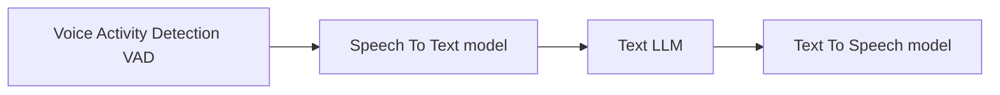
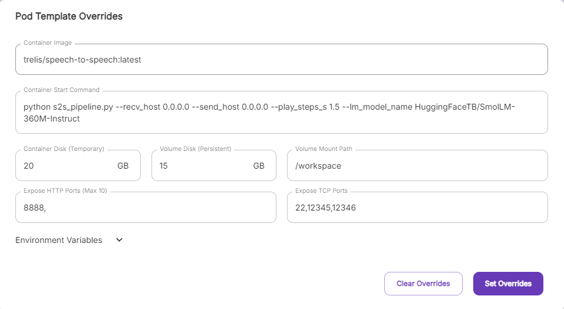
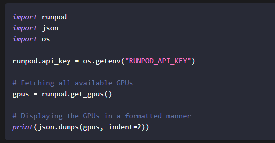
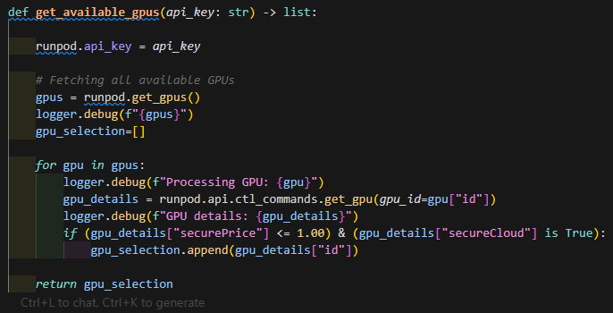
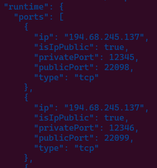
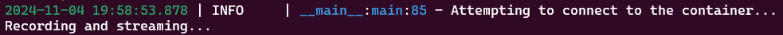

# Welcome

- Vision
- Mission
- How to Connect - [Signup](https://hsv.ai/subscribe)

# Let's Talk It Out: Open Source Speech to Speech

## Hugging Face
https://github.com/huggingface/speech-to-speech

Hugging Face has released an open source capability that is similar to OpenAI's GPT4o speech to speech. This utilizes a modular approach with a series of lightweight models in an easily usable pipeline. There are some default settings in the provided repo, but you can drop in other models from Hugging Face's Transformers library.

The easiest way to try this out is on a Mac with at least 24GB of memory. Simply clone the repo, and run this:

`python s2s_pipeline.py --local_mac_optimal_settings`

## Client-Server with RunPod
This is also possible with a client-server approach, using a template that is available on RunPod. We've discussed RunPod here before, but exploring this project showed me the RunPod documentation is still in development. 

This template is a good way to test out S2S. It's made available to the public and has notes on how to access it with a client, which is good for one-off applications. But what if you want to make your own model, and need to use RunPod for your own testing or training? 

(show the issue with spinning up the pod repeatedly)

Anytime a Pod is spun up, its IP address and external ports are randomly generated. In this particular pipeline, I was waiting for the ports to open before starting the client portion of the pipeline, and having to type in the connection info too many times. 

## Documentation?
https://docs.runpod.io/sdks/python/apis

The API documentation focuses heavily on GraphQL with endpoints in Go, JavaScript, and Python. 

https://graphql-spec.runpod.io/

While the GraphQL documentation is extensive, it was unwieldy for someone of my skill level. So I wrote my own pipeline in Python to automate Pod creation and destruction.

## Some Code!

I started off with what RunPod does provide.

But that didn't give me enough detail for automation.

I grab the first pod available and spin it up, with the template I provided. I continuously query the pod until I get the public IP address and public ports available, then capture that, and send it to my client.

The client dials in, and success, we can talk to it!

And when I am done, I want to clean up my deployment.

## Questions?