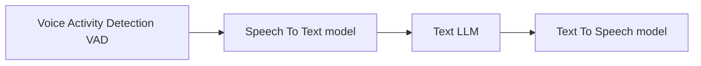
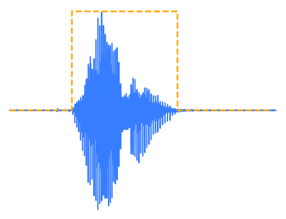

# Welcome

- Vision
- Mission
- How to Connect - [Signup](https://hsv.ai/subscribe)

# Let's Talk It Out: Open Source Speech to Speech

## What Is It?

Speech to Speech (S2S) is the capability for humans and computer systems to interact using only voice. 

## Hugging Face
https://github.com/huggingface/speech-to-speech

Hugging Face has released an open source capability that is similar to OpenAI's GPT4o speech to speech. This utilizes a modular approach with a series of lightweight models in an easily usable pipeline. There are some default settings in the provided repo, but you can drop in other models from Hugging Face's Transformers library.

## Voice Activity Detection

VAD is a technique to detect the presence or absence of human speech. Some of the most common forms of VAD are found in our phones or Amazon devices, or the technical term, "voice user interfaces". In this application, it is used to detect not only when a voice is present, but once it becomes absent. This tells the next portion of the Speech-To-Speech pipeline to begin. 

## Speech To Text

By definition, Speech To Text is voice recognition software that dictates spoken words into text. OpenAI released on GitHub Whisper, an automatic speech recognition system that was trained on 680,000 hours of data. But that comes at a cost of size, and OpenAI's Whisper-Large-V3 is 1.5B parameters. This pipeline uses a model from Distil-Whisper, a distilled form of Whisper that is about half the size and 6 times faster. 

## What Do You Mean, Distilled?

Knowledge Distillation is a compression technique where a smaller model is trained to reproduce the behavior of a larger model. The simple explanation of what Distil-Whisper is that the first and last layer of the weights from the Whisper model are copied into a smaller model, and then transcription knowledge is transferred from the Whisper model into this smaller model. In short, it's a great way to take a large model's learning and compress it into a smaller space.

## Text LLM

When we say "text LLM" we specifically mean that the inputs and outputs of the LLM are text-based. You type text into ChatGPT or Claude, and you get text back.

Hugging Face make a clarification that this pipeline uses any instruction-following text LLM. The "instruction-following" is the basic task of the LLM. If a human gives the LLM an instruction, it's expected that the LLM will follow the instruction. "Tell me a story," or "What is the air-speed velocity of an unlaiden swallow?"

## Text To Speech

Text To Speech is the simulation of natural speech given a piece of text. One of the most common TTS systems can be heard in airports or subway announcement systems. 

## How do I try it?

The easiest way to try this out is on a Mac with at least 24GB of memory. Simply clone the repo, and run this:

`python s2s_pipeline.py --local_mac_optimal_settings`

Or you can use a client-server system, where your have a server doing all of the heavy lifting, and a client with speakers and a microphone interacting with it. 

## Questions?